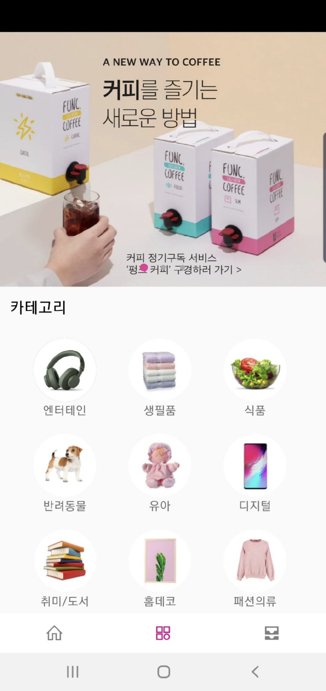
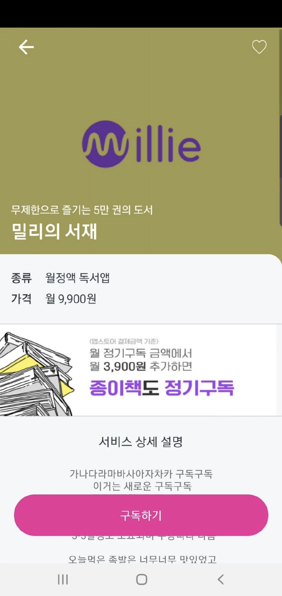
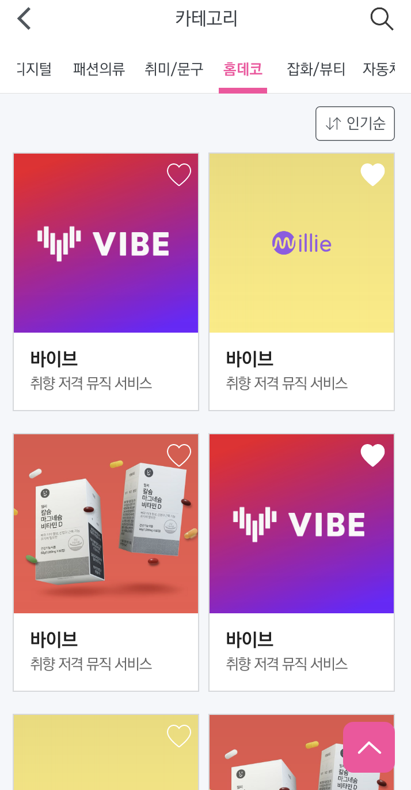

# SOLscript


밀레니엄 세대를 중심으로 **구독 경제**가 일상에 깊숙이 자리 잡고 있다. 구독 경제(subscription economy)란 소비자가 정기적으로 비용을 지급하여 원하는 상품을 배송받거나, 일정 기간 서비스를 이용하는 것을 뜻한다.

현재 구독 경제는 2020년 594조 원 전망을 나타내며 소비의 새로운 패러다임으로 자리 잡았다. 하지만 서비스를 구매하던 기존의 방식이 익숙한 소비자들은 여전히 제한적인 서비스만을 이용하거나, 다양한 결재체계로 흩어져 구독 중인 서비스로 인해 관리에 어려움을 겪고 있다. 따라서 우리 팀은 신한 계열사들의 API들을(목록 아래 기제) 사용하여서 통합적으로 구독 서비스를 관리할 수 있는 플랫폼을 만들고자 한다.

\
[]()

---
\
\
\
\
[]()
# Info
### Features
* 📡 신한그룹 API를 사용하여 계좌, 카드 등록후 구독 간편화.
* 📦 신한그룹 API를 사용하여 유저의 구독 서비스 자동 추출.
* 💬 챗봇과 대화를 통한 사용자의 취향 분석.
* 📝 유저의 구독 서비스 사용패턴 분석.
* 📚 스크린 타임 조회를 통해 이전 달과의 사용률을 비교한 통계 제공.
\
\
\
[]()
### API Description
* [API 명세서 링크](https://github.com/SOLscript/SOLscript_server/wiki)
\
\
\
\
[]()
### Usage Video
* 아래 이미지 클릭\
[](https://youtu.be/P2ChpiO9nnE)
\
[]()

---
\
\
\
\
[]()
# Design Pattern
### Strategy Pattern
* 행위를 클래스로 캡슐화해 동적으로 행위를 자유롭게 바꿀 수 있게 해주는 패턴.
* 같은 문제를 해결하는 여러 알고리즘이 클래스별로 캡슐화되어 있고 이들이 필요할 때 교체할 수 있도록 함으로써 동일한 문제를 다른 알고리즘으로 해결할 수 있게 하는 디자인 패턴.
* 즉, 전략을 쉽게 바꿀 수 있도록 해주는 디자인 패턴이다.
전략이란
어떤 목적을 달성하기 위해 일을 수행하는 방식, 비즈니스 규칙, 문제를 해결하는 알고리즘 등
특히 게임 프로그래밍에서 게임 캐릭터가 자신이 처한 상황에 따라 공격이나 행동하는 방식을 바꾸고 싶을 때 스트래티지 패턴은 매우 유용하다.\
\
\
[]()

[참고 URL](https://gmlwjd9405.github.io/2018/07/06/strategy-pattern.html)
\
[]()

---
\
\
\
\
[]()
# Foldering

 | Module | Router |
|:---:|:---:|
|  |  |

---
\
\
\
\
[]()
# Usage Package

``` 
"dependencies": {
    "dialogflow": "^0.14.1",
    "dialogflow-fulfillment": "^0.6.1",
    "actions-on-google": "^2.12.0"
  }
```
NLP Model로 Google Dialogflow를 사용했고, Google Client Library를 사용해서 SOLscript서버를 proxy server로 이용 및, webhook을 이용해 fulfillment처리를 하였다.
\
\
\
[]()
```
"dependencies": {
    "aws-sdk": "^2.575.0",
    "multer": "^1.4.2",
    "multer-s3": "^2.9.0",
    "mongoose": "^5.7.12"
}
```
Database로 MongoDB와 AWS의 S3를 사용했다.
\
\
\
[]()
```
"dependencies": {
    "request": "^2.88.0",
    "request-promise": "^4.2.5"
}
```
Shinhan Bank, Shinhan Card API를 비동기적으로 사용하기 위해 request-promise(request dependency에 의존적)를 사용했다.
\
[]()

---
\
\
\
[]()
# Core Technology
**Dialogflow**\
SOLscript는 챗봇 soly와의 대화를 통해 유저의 취향을 분석한 후 유저에게 맞춤형 구독 서비스를 추천해준다. 취향 분석은 Price, Category, Feel 총 3가지의 기준으로 분석하며, 유저가 정형화되지 않은 답변을 하더라도 챗봇이 해당 발화의 Entity를 추출하여 준비된 키워드에 맵핑시킨다. 또한 사용자의 구독 서비스 현황이나, 자주 사용하는 구독 서비스 현황 등에 대한 질문을 Database접근 및 내부 로직을 통해 답변할 수 있다. 

[참고자료: Dialogflow Reference](https://cloud.google.com/dialogflow/docs/reference/rest/v2/projects.agent.sessions/detectIntent)

\
\
[]()
**Shinhan API**\
신한은행 및 카드 API를 사용해서 카드를 등록해서 간편하게 구독 서비스를 관리할 수 있도록 기능을 제공하였고, 유저의 카드 사용내역을 조회 및 파싱하여 사용자의 구독 서비스 사용패턴을 분석한 후 제공하였다.
\
[]()

---
\
\
\
[]()
# Application Lifecycle Management
### Agile

**1. 팀원과의 기술스택을 맞춘다.**
\
해커톤이 시작되기전 팀원들과의 기술스택을 맞추고, foldering이나 code convention과 같은 부분들을 미리 점검하였다. 그로 인해 해커톤 당일 git merge로 인한 comflict를 최소화할 수 있었고, 업무 분배에 있어서 유동적이었다.
\
\
**2. 내부적 협력**
\
당일에 공개되는 api로 인해 설계에 대한 불확실성이 있었다. 때문에 모든 부분을 설계하기보단 핵심 기능에 우선순위를 두고 해커톤 당일에 애자일하게 설계 및 개발을 이어나갔다. 이로인해 예상하지 못했던 에러를 만나게 되었을 때 유동적으로 설계를 변경하고 학습하며 개발할 수 있었다.
\
\
**3. 패드백**
\
5 ~ 6시간에 한번씩 주기적으로 피드백을 주고받는 시간을 가졌다. 피드백을 통해 디자인과의 절충안, 클라이언트와의 통신에 관한 부분을 지속적으로 체크하였다. 지속적인 피드백을 통해 각 파트간의 진행상황을 확인할 수 있었고, 이러한 시너지 효과는 프로젝트에 기여되었다.
\
\
[해커톤 후기: 윤자이 기술블로그](https://ooeunz.tistory.com/59)
\
[]()

---
\
\
\
[]()
 # Application Image

 | MainActivity | MyPageActivity | CardInfoActivity |
|:---:|:---:|:---:|
| | | |

| CardActivity | CardRegisterActivity | ChatActivity |
|:---:|:---:|:---:|
| |  | |

| SubscriptCalenderFragment | SubscriptCalenderFragment | SubscriptManageFragment |
|:---:|:---:|:---:|
||| |

| AnalysisActivity | CategoryFragment | DetailedActivity | CategoryContentFragment |
|:---:|:---:|:---:|:---:|
||| |